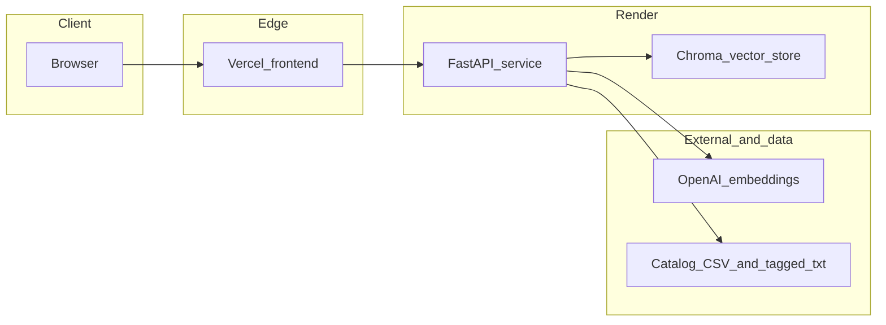

# Book Recommendation System - BackEnd

Semantic book recommendations over a curated catalog: natural-language search, optional **category** and **tone** filters, and **OpenAI embeddings** stored in an in-memory **Chroma** index. This repository is the **FastAPI backend**, intended to run on **[Render](https://render.com/)**; the user-facing app is hosted on **[Vercel](https://vercel.com/)**.

This project is shared to **demonstrate implementation and stack choices**.

## Live demo

- **Web app (Vercel):** [https://your-project.vercel.app](https://your-project.vercel.app) _(replace with your deployment URL)_
- **API (Render):** [https://your-service.onrender.com](https://your-service.onrender.com) _(replace with your Render web service URL; use it as the frontend’s API base)_
- **Backend source (GitHub):** [github.com/SauelAlmonte/book-recommendation-system-backend](https://github.com/SauelAlmonte/book-recommendation-system-backend)
- **Frontend source:** _(add your Vercel app’s repository if it is separate from the backend)_
- OpenAPI **`/docs`** is available when the Render service runs with `ENVIRONMENT=dev`; production typically uses `ENVIRONMENT=prod`, which disables the interactive docs.

## What I built

- **REST API** with liveness (`/health`), readiness (`/ready`), and a **recommendations** endpoint that validates inputs with **Pydantic**.
- **Retrieval pipeline:** load catalog metadata from CSV, embed **one line per book** from a tagged text file using **LangChain** loaders and **OpenAI** embeddings, index in **Chroma**, then **rank** and **filter** by category and emotional tone columns.
- **Operational guardrails:** startup **catalog validation** (paths, headers, first-line ISBN check) so misconfigured data fails fast before expensive embedding work.
- **Data tooling:** optional [`scripts/build_catalog.py`](scripts/build_catalog.py) and [`notebooks/`](notebooks/) workflows to reproduce the Kaggle-based catalog; **pytest** coverage for validation and routes, with **CI** for offline tests.

## Architecture

## Tech stack

| Area | Technologies |
| ------ | ---------------- |
| Language | Python 3.10+ |
| API | [FastAPI](https://fastapi.tiangolo.com/), [Uvicorn](https://www.uvicorn.org/), [Pydantic](https://docs.pydantic.dev/) v2, [pydantic-settings](https://docs.pydantic.dev/latest/concepts/pydantic_settings/) |
| LLM / RAG | [LangChain](https://python.langchain.com/) (`langchain`, `langchain-community`, `langchain-openai`, `langchain-text-splitters`, `langchain-chroma`), OpenAI embeddings API |
| Data | [pandas](https://pandas.pydata.org/), NumPy |
| Config | [python-dotenv](https://github.com/theskumar/python-dotenv) |
| Tests | [pytest](https://pytest.org/), [HTTPX](https://www.python-httpx.org/) |
| Optional catalog build | [kagglehub](https://github.com/Kaggle/kagglehub), [transformers](https://huggingface.co/docs/transformers), PyTorch, tqdm _(see [`pyproject.toml`](pyproject.toml) `[catalog-build]` extra)_ |

## Data and resources

- **Source metadata (public):** [7k Books on Kaggle](https://www.kaggle.com/datasets/dylanjcastillo/7k-books-with-metadata) — dataset id `dylanjcastillo/7k-books-with-metadata`.
- **Embeddings:** OpenAI embedding models via `langchain-openai` (no keys in this repo).

## API surface (summary)

| Method | Path | Description |
| -------- | ------ | ------------- |
| GET | `/health` | Liveness |
| GET | `/ready` | Readiness when catalog and vector index are loaded |
| POST | `/v1/recommendations` | Semantic search with optional `category`, `tone`, and `limit` |

Full request and response shapes appear in the interactive **OpenAPI** schema when the API runs in development mode.

## Developer documentation

Detailed setup (environment, catalog files, running the API locally, tests, and deployment notes) lives in **[docs/DEVELOPING.md](docs/DEVELOPING.md)**.

## License

MIT — see [LICENSE](LICENSE).
